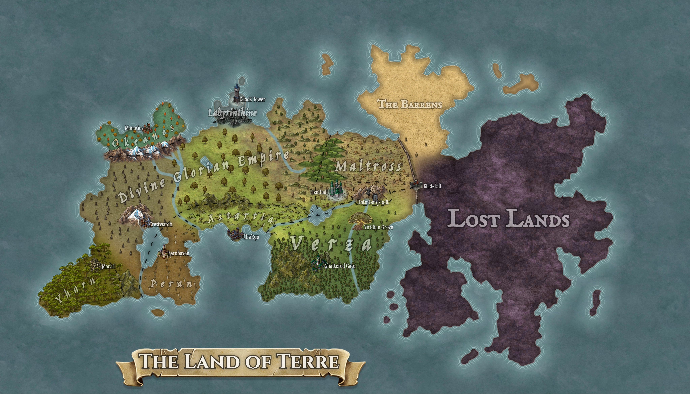

# Geography

*This map is possibly outdated.*

---

The continent of Terre is a huge landmass surrounded by the endless Oceanic Expanse. The landmass is approximately 4000 km from west to east, and 2000 km from north to south. To the center of the land towards the east a bit, a piece of land connects three major peninsulas together, dividing Terre into three large parts.

To the north is a large desert known as the Barrens or the Outlands. Resource is scarce, and survival is a challenge. Many outlander races: Orcs, Goblinoids, Lizardfolks, Dragonborns, and some others, resides in the Barrens, forming feral tribes and societies, sometimes assaulting each other and other parts of Terre, but under circumstances they can be reasoned with. 

To the east, the Lost Lands span almost one third of Terre, its territory lost to the Iris Corruption. Little is known about what the Lost Lands currently looks like, as few have even ventured over the High Wall, not to mention deep enough and survive and come back sane.

To the west is the currently civilized territories of Terre. A great wall, known as the High Wall of Bladefall, separates and defends civilized Terre from the Corruption in the Lost Lands and the tribal assaults in the Barrens. The namesake of this defense, Bladefall, is a great frontier bastion on the southern part of the High Wall, housing many adventurers, and their hopes and dreams.

Immediately to the west of the Highwall lies the lands of Maltross and Verza. Maltross is to the north, consisting of deserts, savannas, and grasslands. The Nomadic State of Maltross controls this region, its inhabitants roaming and grazing on the flora and fauna. Verza is to the south, a land of green and nature, filled with forests of all kind. A giant fairy oak, several hundred meters tall, known as the Viridian Grove, is located in the northern part of Verza, irrigated by the mountain springs of Hollunberg, and houses the druidic forces of the Verzae Legion.

Hollunberg is a mountain range directly west of Bladefall, between Maltross and Verza. Dwarves have resided inside the mountain since the beginning of history, forming their kingdom named Undergebirgsreich. They do not claim much territory and have largely remained neutral and friendly towards other regions.

The western parts of Maltross features small hills and grass dunes, nicknamed 'the Mound', housing many halffolks known for their hospitality. Further west, the land quickly declines into swamps, marshes, and wetlands. The region is known as Albion's March, scattered by a dozen of fractured kingdoms, waging war on each other and fighting for the meager natural resources the swamp can provide.

At the center of Albion's March, the Ringed Sea houses a great tempest of arcane energy, known as the Folly of Storm, constantly erupting and driving the weather in nearby coastal areas to the extreme. Labyrinthine, a small island in the eye of the storm, is home to the Mages' Guild and the Clock Tower. The island is treacherous and barren, spiked by dark stone spires and pillars, leaving little for common folks. North of the Ringed Sea, an archipelago chain shields Labyrinthine and the Ringed Sea from the open ocean, and contains the arcane tempest within.

West of Albion's March the massive lands of the Divine Glorian Empire. An theocratic empire of Gloria worshippers claims the largest piece of land on civilized Terre, spanning almost a third of the horizontal length of the entire continent. Its territories houses various geographical features, from the temporate forests in the bordering Albion's March, to the taigas in the westmost part, where the highest mountain peak, the Crest of Terre, sits just above Crestwatch, the capitol of the Divine Empire, and the Jewel of Terre, a large beautiful lake with frequent water travels.

Another river originating from Hollunberg flows west bordering the northern part of Verza from the Divine Glorian Empire, as well as the land of Astartia. Astartia is a fertile land full of agricultural activities, in the shape of a long east-west strip, bordered from the north by the Divine Glorian Empire, the south by the Clearwater Gulf.

On the westside of the Gulf, bordering Astartia, is a barren and exploited land named Peran. The Perani Trading Corporation tapped the land out of its natural resources, leaving petrified trees and bleached bones, with machinaries abandoned everywhere. The capitol Barohaven sits on the other side of the Jewel of Terre, across from Crestwatch and the Divine Empire, establishing heavy trade and travel on the Jewel.

To the very southern west of Terre is a dense jungle known as Yharn. Tribes of skinwalkers resides within, with little contact to the outside world, living off their ancestral knowledges and experiences. Most of the few visitors end up in Mecatl, a city of stone and vine on the border of Yharn and the Divine Empire. The dense canopy covers the sky, nurturing unique flora and fauna, friendly and dangerous alike, and a mysterious, supernatural danger in the night.

To the north-west of the Divine Glorian Empire and Terre, the Mount Taignos Range, a large series of snowy-peaked mountains, isolates Okeanos from the rest of civilization. This provincial region of the old Forgotten Empire is all that the Empire left behind after its crumbling, due to its natural defenses and its demographical extremity. The land itself is filled with natural beauty, capable of capturing the heart of any that treads in, but its inhabitants unwelcoming to all foreigners.